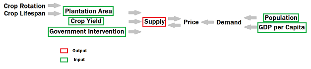
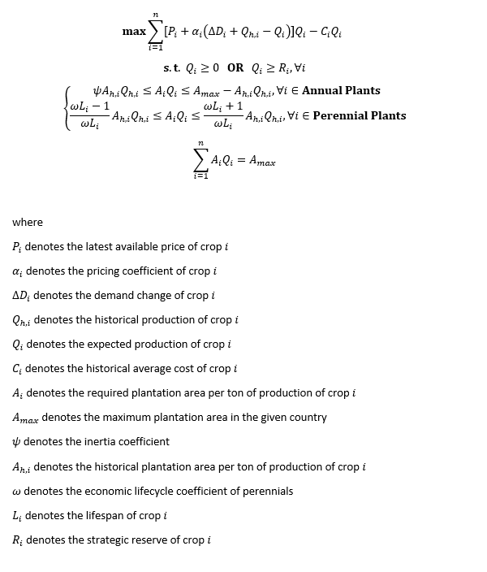
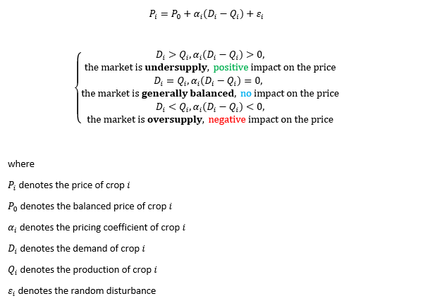

# farmers-vs-volatility
Hedging strategy simulation for farmers facing commodity price volatility, using futures contracts and stochastic modeling. Applied quantitative finance with real-world impact.

Introduction:

Fruits, grains, and root vegetables — are staples we often overlook. Yet the COVID-19 crisis reminded us that farmers are underpaid despite being essential to our survival. This project aims to rethink agricultural efficiency by leveraging financial market tools. The core idea: if agricultural production were optimized like a trading strategy, we could reduce waste and ensure fairer compensation for farmers.

We simulate rational decision-making by modeling farmers as profit-maximizing agents subject to natural and policy constraints. Using convex optimization, the project estimates optimal crop allocation strategies under market-driven price dynamics. The end goal is to develop a smart pricing mechanism for trading soft commodities like rice, coffee, and chocolate, based on predicted supply-side behavior.

Assumptions & Economic Rationale:

This model rests on a variant of the Efficient Market Hypothesis: while market behavior may appear irrational in detail, it can often be simplified to supply-demand equilibrium on a macro scale. To this end, all farmers in a country are aggregated into a single representative agent whose goal is to maximize margin, assuming they behave like Homo Economicus.

To stabilize and simplify the model, several assumptions are made:

Stable weather conditions: No major climatic events (e.g., droughts, floods, locusts) disrupt planning. Extreme shocks can be integrated later via risk-adjusted costs or stochastic modeling.
Static domestic demand: Demand is considered constant in the short term and driven primarily by demographics and income. Industrial or livestock usage is assumed to evolve slowly.
No disruptive AgriTech breakthroughs: The yield function assumes current technology levels. Innovations like vertical farming or advanced GMOs, which could drastically alter yields, are excluded for tractability.
No cross-border arbitrage: The model assumes a closed economy. International trade frictions (tariffs, freight) are not considered, though they could be integrated later.
No logistics frictions: Crops are assumed to reach their destination efficiently. Overproduction is absorbed, and underproduction results in missed market opportunities — not spoilage.
Uniform quality and pricing: All crops of a given type are treated as homogenous, with no premium for organic, local, or high-grade produce.
heoretical Framework:

Objective:
Maximize the total economic profit from crop production based on endogenous market prices and supply levels.

Constraints:
Government policies (e.g., subsidies, quotas)
Crop-specific requirements, such as:
Rotation rules for annual crops
Longevity of perennials
Land availability (total arable land per season)

As stated in the assumptions, the primary goal of farmers in this model is straightforward: maximize profit. Profit is defined as the unit revenue minus the unit cost, multiplied by the quantity produced. Naturally, farmers aim to maximize output, especially since they have limited control over input costs. However, this strategy can backfire—overproduction can lead to a drop in market prices, ultimately reducing total revenue. Farmers must therefore strike a careful balance in their crop allocation. When a particular crop becomes oversupplied, they must assess whether a larger market share can offset the loss in price, or if it's more prudent to shift to alternative crops. Mathematically, this trade-off defines the pricing mechanism behind crop selection. We'll dive deeper into the pricing structure later, but for now, let’s briefly outline the objective function: it comprises a profit maximization goal, a sum over all crops, revenue (price times quantity), and production costs.

Cost modeling is complex. Agricultural cost data, like those from the FAO, are multidimensional and often overwhelming. Based on US farming expenditure reports, the largest costs are labor, land, fertilizers, and seeds. Many expenses—such as rent, machinery, and basic maintenance—are fixed regardless of the crop grown. Similarly, labor requirements remain relatively constant unless there's a major change in production strategy. Since farmers can often reuse seeds from previous harvests, we narrow the cost variables down to fertilizers and pesticides. Thankfully, organizations like the IFA provide free data, although each crop requires specific nutrient mixes. After several discussions and analysis, we realized that for modeling aggregate behavior, cost variation has a relatively limited mathematical impact—constraints drive more of the model. Thus, we compute cost simply using production-weighted averages.

Still, modeling farmer behavior isn’t just a profit equation. Government policies play a key role. For instance, farmers may receive subsidies for growing specific crops, especially those that align with environmental or food security objectives. In the EU, for example, a significant portion of the budget supports farmers who meet sustainability targets (e.g., €375 per hectare). Some governments maintain grain stockpiles to guard against future shortages, which may require a minimum production threshold. These policy interventions form the first inequality constraint of our model and are reflected either as minimum required or non-negative production levels for certain crops.

Biological characteristics of crops also introduce constraints. Crops can be annual, biennial, or perennial. Annuals grow and are harvested within a year and are subject to crop rotation to maintain soil health. Biennials span two years, but for simplicity, we treat them as annuals in this model—a common practice in the field. Perennials, on the other hand, take several years to mature and often outlive their growers. Because they bear fruit for multiple years, farmers have less flexibility in adjusting their production based on annual price changes.

This gives rise to the second inequality constraint: production levels are bounded above and below. The lower bound for annual crops reflects inertia—even with flexibility, farmers don’t often overhaul their entire strategy in one season. Crop knowledge, soil compatibility, and even irrigation conditions limit their choices. We capture this inertia with a coefficient ψ, defaulted to 0.8, meaning at least 80% of current planting remains stable from year to year.

The upper bound for annual crops arises from crop rotation. Continuous monoculture invites pest buildup and depletes soil nutrients. Crop rotation, by contrast, enhances resilience. This means the maximum area that can be planted with crop i next year equals the total available land minus the area already used for crop i this year—in other words, crop i can only expand into land used by other crops.

For perennials, the lower threshold is linked to their economic lifespan. Since we lack exact age distribution data, we assume it’s uniform. Each year, a fixed fraction of perennial plants reach the end of their productive life and need to be replaced. This fraction is modeled as 1 / (ωL), where ω is an economic lifecycle factor (suggested as 0.7 by agronomists), and L is the average lifespan of the plant.

The upper bound for perennials accounts for their long growth cycle. Some trees need years before they yield anything. Even if a farmer aggressively expands their plantation, the actual harvest won’t increase immediately. In practice, the maximum harvest increase equals the share of crops that would have been replaced this year, based on the uniform age assumption.

Lastly, we confront the most binding constraint: land availability. Arable land is limited, and any expansion—like deforestation—typically requires approval (especially under ESG standards). Moreover, crops differ in space requirements. For example, trees require spacing to avoid competition for light and water, while tubers can be densely planted. We estimate land demand based on the inverse of historical crop yields, adjusting implicitly for average weather risks.

This constraint defines our land equality condition: the total cultivated area must not exceed the available land. Land use forecasts are uncertain—affected by new permits or disasters—so we either rely on the most recent known values or construct expert-driven scenarios. One complication here is that some crops mature in months, while our model operates on an annual time step. This can lead to double-counting harvest areas, artificially inflating the sum of cultivated land. While this is a known limitation, it remains unresolved for now.

With the objective function and constraints defined, we can now turn to the core of the model: pricing. Drawing from microeconomic theory, we use the concept of market equilibrium—where supply and demand curves intersect—to determine prices. This classical framework, introduced by Alfred Marshall, provides a natural bridge to modeling crop price formation in our system.

