# farmers-vs-volatility
Hedging strategy simulation for farmers facing commodity price volatility, using futures contracts and stochastic modeling. Applied quantitative finance with real-world impact.

Introduction:

Fruits, grains, and root vegetables — are staples we often overlook. Yet the COVID-19 crisis reminded us that farmers are underpaid despite being essential to our survival. This project aims to rethink agricultural efficiency by leveraging financial market tools. The core idea: if agricultural production were optimized like a trading strategy, we could reduce waste and ensure fairer compensation for farmers.

We simulate rational decision-making by modeling farmers as profit-maximizing agents subject to natural and policy constraints. Using convex optimization, the project estimates optimal crop allocation strategies under market-driven price dynamics. The end goal is to develop a smart pricing mechanism for trading soft commodities like rice, coffee, and chocolate, based on predicted supply-side behavior.

Assumptions & Economic Rationale:

This model rests on a variant of the Efficient Market Hypothesis: while market behavior may appear irrational in detail, it can often be simplified to supply-demand equilibrium on a macro scale. To this end, all farmers in a country are aggregated into a single representative agent whose goal is to maximize margin, assuming they behave like Homo Economicus.

To stabilize and simplify the model, several assumptions are made:

Stable weather conditions: No major climatic events (e.g., droughts, floods, locusts) disrupt planning. Extreme shocks can be integrated later via risk-adjusted costs or stochastic modeling.
Static domestic demand: Demand is considered constant in the short term and driven primarily by demographics and income. Industrial or livestock usage is assumed to evolve slowly.
No disruptive AgriTech breakthroughs: The yield function assumes current technology levels. Innovations like vertical farming or advanced GMOs, which could drastically alter yields, are excluded for tractability.
No cross-border arbitrage: The model assumes a closed economy. International trade frictions (tariffs, freight) are not considered, though they could be integrated later.
No logistics frictions: Crops are assumed to reach their destination efficiently. Overproduction is absorbed, and underproduction results in missed market opportunities — not spoilage.
Uniform quality and pricing: All crops of a given type are treated as homogenous, with no premium for organic, local, or high-grade produce.
heoretical Framework:

Objective:
Maximize the total economic profit from crop production based on endogenous market prices and supply levels.

Constraints:
Government policies (e.g., subsidies, quotas)
Crop-specific requirements, such as:
Rotation rules for annual crops
Longevity of perennials
Land availability (total arable land per season)

As stated in the assumptions, the primary goal of farmers in this model is straightforward: maximize profit. Profit is defined as the unit revenue minus the unit cost, multiplied by the quantity produced. Naturally, farmers aim to maximize output, especially since they have limited control over input costs. However, this strategy can backfire—overproduction can lead to a drop in market prices, ultimately reducing total revenue. Farmers must therefore strike a careful balance in their crop allocation. When a particular crop becomes oversupplied, they must assess whether a larger market share can offset the loss in price, or if it's more prudent to shift to alternative crops. Mathematically, this trade-off defines the pricing mechanism behind crop selection. We'll dive deeper into the pricing structure later, but for now, let’s briefly outline the objective function: it comprises a profit maximization goal, a sum over all crops, revenue (price times quantity), and production costs.

Cost modeling is complex. Agricultural cost data, like those from the FAO, are multidimensional and often overwhelming. Based on US farming expenditure reports, the largest costs are labor, land, fertilizers, and seeds. Many expenses—such as rent, machinery, and basic maintenance—are fixed regardless of the crop grown. Similarly, labor requirements remain relatively constant unless there's a major change in production strategy. Since farmers can often reuse seeds from previous harvests, we narrow the cost variables down to fertilizers and pesticides. Thankfully, organizations like the IFA provide free data, although each crop requires specific nutrient mixes. After several discussions and analysis, we realized that for modeling aggregate behavior, cost variation has a relatively limited mathematical impact—constraints drive more of the model. Thus, we compute cost simply using production-weighted averages.

Still, modeling farmer behavior isn’t just a profit equation. Government policies play a key role. For instance, farmers may receive subsidies for growing specific crops, especially those that align with environmental or food security objectives. In the EU, for example, a significant portion of the budget supports farmers who meet sustainability targets (e.g., €375 per hectare). Some governments maintain grain stockpiles to guard against future shortages, which may require a minimum production threshold. These policy interventions form the first inequality constraint of our model and are reflected either as minimum required or non-negative production levels for certain crops.

Biological characteristics of crops also introduce constraints. Crops can be annual, biennial, or perennial. Annuals grow and are harvested within a year and are subject to crop rotation to maintain soil health. Biennials span two years, but for simplicity, we treat them as annuals in this model—a common practice in the field. Perennials, on the other hand, take several years to mature and often outlive their growers. Because they bear fruit for multiple years, farmers have less flexibility in adjusting their production based on annual price changes.

This gives rise to the second inequality constraint: production levels are bounded above and below. The lower bound for annual crops reflects inertia—even with flexibility, farmers don’t often overhaul their entire strategy in one season. Crop knowledge, soil compatibility, and even irrigation conditions limit their choices. We capture this inertia with a coefficient ψ, defaulted to 0.8, meaning at least 80% of current planting remains stable from year to year.

The upper bound for annual crops arises from crop rotation. Continuous monoculture invites pest buildup and depletes soil nutrients. Crop rotation, by contrast, enhances resilience. This means the maximum area that can be planted with crop i next year equals the total available land minus the area already used for crop i this year—in other words, crop i can only expand into land used by other crops.

For perennials, the lower threshold is linked to their economic lifespan. Since we lack exact age distribution data, we assume it’s uniform. Each year, a fixed fraction of perennial plants reach the end of their productive life and need to be replaced. This fraction is modeled as 1 / (ωL), where ω is an economic lifecycle factor (suggested as 0.7 by agronomists), and L is the average lifespan of the plant.

The upper bound for perennials accounts for their long growth cycle. Some trees need years before they yield anything. Even if a farmer aggressively expands their plantation, the actual harvest won’t increase immediately. In practice, the maximum harvest increase equals the share of crops that would have been replaced this year, based on the uniform age assumption.

Lastly, we confront the most binding constraint: land availability. Arable land is limited, and any expansion—like deforestation—typically requires approval (especially under ESG standards). Moreover, crops differ in space requirements. For example, trees require spacing to avoid competition for light and water, while tubers can be densely planted. We estimate land demand based on the inverse of historical crop yields, adjusting implicitly for average weather risks.

This constraint defines our land equality condition: the total cultivated area must not exceed the available land. Land use forecasts are uncertain—affected by new permits or disasters—so we either rely on the most recent known values or construct expert-driven scenarios. One complication here is that some crops mature in months, while our model operates on an annual time step. This can lead to double-counting harvest areas, artificially inflating the sum of cultivated land. While this is a known limitation, it remains unresolved for now.

With the objective function and constraints defined, we can now turn to the core of the model: pricing. Drawing from microeconomic theory, we use the concept of market equilibrium—where supply and demand curves intersect—to determine prices. This classical framework, introduced by Alfred Marshall, provides a natural bridge to modeling crop price formation in our system.

By using linear approximation, we obtain the equation above. Price of crop i equals to the equilibrium price plus the mismatch between supply and demand. When supply exceeds demand, the market condition is oversupply. The difference between demand and supply is undisputedly negative. After multiplied by pricing coefficient α, the difference converts from several hundred tonnes to the scale of US dollar per tonne. The equation easily generates a downward pressure on the equilibrium price, and vice versa. With some random disturbance ε (force majeure), the linear regression emerges.

Now that we obtain the pricing mechanism, we shove it back into the original objective function. Because the income per crop is estimated via last available price, the expected unit revenue equals to the latest price plus the change of the price caused by supply fluctuation through the pricing mechanism. The price change can be easily derived via the first order difference of price at time t and t-1. We already know the number of this year’s supply but want to get the answer of next year’s, so we use next year’s supply minus this year’s supply instead of the abbreviation of ∆Q. What is ∆D though?

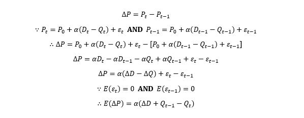

Let’s solve the final piece of the puzzle. Prior to our assumptions of demand, demand is driven by the population and the disposable income. Disposable income is slightly complicated to compute but we can easily find its substitute, GDP per capita. Intuitively we can create a regression model like the pricing mechanism. The only problem is we cannot directly observe the value of demand which bridges the gap between two regression models.

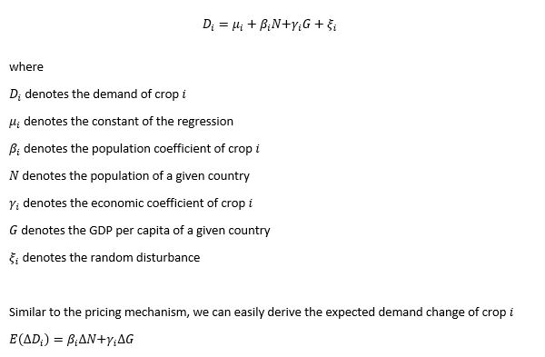

Fortunately, there’s an econometric approach known as the instrumental variable method. By applying Two-Stage Least Squares (2SLS), we can draw causal insights from observational data, even in the presence of endogeneity. A valid instrument should influence the unobserved variable (here, expected production) but should not be directly related to the dependent variable—except through that channel. In simpler terms, population size and GDP per capita are excellent candidates: they don’t directly impact crop prices but affect them indirectly by shifting demand levels. With this setup, the only missing piece of the puzzle becomes the expected output of each crop.

To determine the optimal production level for each crop, we turn to a tool from convex optimization: quadratic programming. This requires translating our system of equations into matrix form, compatible with solvers like CVXOPT. A few adjustments are needed for implementation: first, instead of maximizing the objective function, we minimize its negative (a standard trick in optimization). Second, all inequality constraints must conform to a “less than or equal to” format, which sometimes means multiplying both sides of an inequality by -1. Lastly, we assemble a block matrix structure to fit the solver’s single-constraint format.

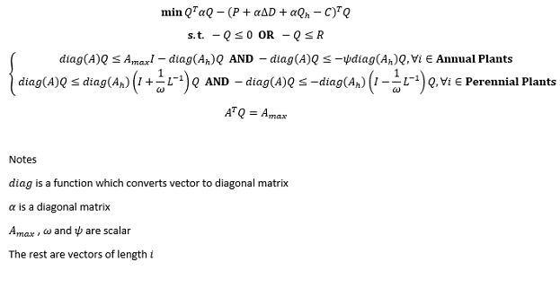

Data Specification

As outlined in the methodology, this model relies on a vast amount of data and requires considerable computational effort. Fortunately, most of the needed data can be accessed in a consistent format from a single reliable source: the Food and Agriculture Organization (FAO) of the United Nations. FAO offers a highly detailed and comprehensive database, including metrics like crop production, yields, land usage, pricing, GDP per capita, population, and more—though many variables go beyond the scope of our current needs. Once decompressed, the dataset reaches around 14 GB, with the international trade file alone taking up nearly 4 GB. Due to file size constraints, the full dataset cannot be uploaded directly to GitHub; users are encouraged to download it directly from the FAO website.

This model covers the period from 2013 to 2018. At the time the project began (June 2020), FAO had not yet released 2019 data. Historical data is available all the way back to 1975 for those who wish to extend the analysis. The country selected for the case study is Malaysia—not out of personal culinary preference, but because of its limited variety of cultivated crops, which simplifies the modeling process. In Malaysia, the number of crop categories is around 61, compared to 111 in Italy. After filtering out crops occupying less than 1% of the total land area, the dataset is narrowed down to 30 crop types.

Even within those 30 categories, missing price data remains a challenge. While traditional imputation methods like using lagged values, averages, or Kalman filtering could be applied, we opted for a more innovative technique: the synthetic control method. Commonly used in political science (notably in studies like Abadie & Gardeazabal, 2003), this method helps estimate the impact of missing data by creating a synthetic version of the country based on comparable nations. In our case, countries with price data for specific crops serve as the control group, while Malaysia represents the treatment group. The assumption is that in a semi-integrated global agricultural market, price differences tend to converge due to arbitrage—unless distorted by trade barriers or protectionist policies. For Malaysia, such barriers are minimal, allowing us to estimate the missing producer prices and normalize them into annual averages in USD.

Despite FAO's breadth, crop lifespan data is one of the few dimensions it lacks. This missing information presents a significant obstacle. As discussed in the theoretical framework, the model favors annual crops to offer flexibility in planting decisions. However, identifying the actual lifespan of perennial crops is less straightforward. A quick online search for the lifespan of an apple tree, for example, returns conflicting answers ranging from 60 to 150 years. To deal with this ambiguity, we adopt a consistent method: we gather only the values from the first page of Google search results, compute their mean, and record them in a file named mapping.csv, available on GitHub. Contributions and corrections are welcome via the Issues tab.

Empirical Results

How well does the model reflect reality? To find out, we perform a backtest. Unlike traditional regressions, convex optimization methods don’t neatly split into in-sample and out-of-sample validations. Instead, we apply a rolling one-step-ahead forecast for each year. For every crop, both price and production forecasts are compared with observed values to assess accuracy. Overall, the model delivers useful insights for around 65% of the crops, which is a solid result—especially considering that, in quantitative trading, even a 55% hit rate can be turned into a profitable strategy.

Rather than overwhelming readers with 30 full case studies, we focus on a representative 25% of the results to showcase different challenges. One interesting example is cabbage. While not commonly found in Malaysian cuisine (at least in my own experience), it presents a useful modeling case. The estimated price trajectory resembles an AR(1) process, where the prediction line (lime green) closely tracks the observed price (green), lagged by a year—likely due to the estimation method combining the last known price with the pricing mechanism.

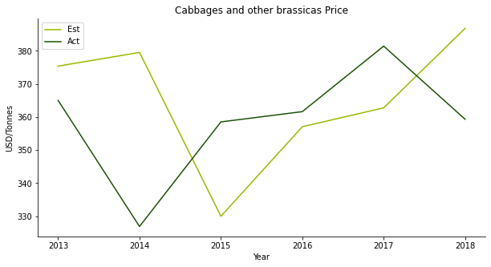

The same can be said to the production backtesting. The red line always lags the violet line by one year.

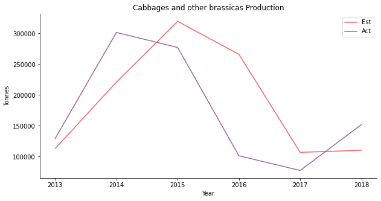

In the actual regression stage, the in-sample data is a nice fit. The purple line captures the overall trend but has a smaller volatility than the yellow line. There is a valid causal relationship between price and supply plus demand. Cabbage is apparently for domestic consumption. Seriously, besides Singapore, why would anyone import cabbage from Malaysia?

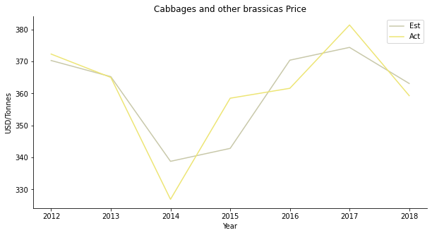

The second one is cocoa. Who doesn’t like chocolates? Although Malaysian cocoa beans isn’t known for its top-notch quality, the cocoa tree occupies quite a large area of plantation area. I suspect it has something to do with the popular drink, Milo Dinosaur. The price forecast shows similar traits as the cabbage, AR1 model.

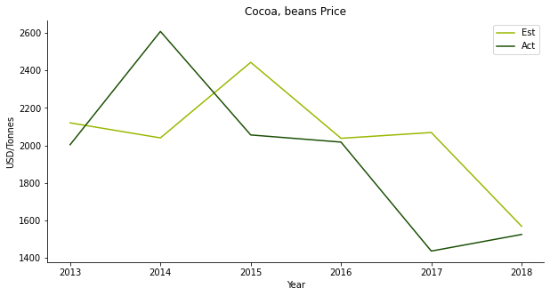

Yet, the production backtest is a different case. It’s a flawless forecast on the production side. Since our model is centered around the expected production, it kind of makes sense.

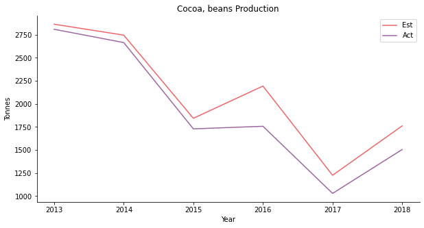

The regression result sounds worrisome. The demand of cocoa beans does not appear to count on GDP per capita or population. I suppose, you buy iced Milo when you are broke and you buy one more spoon on top when you are rich?

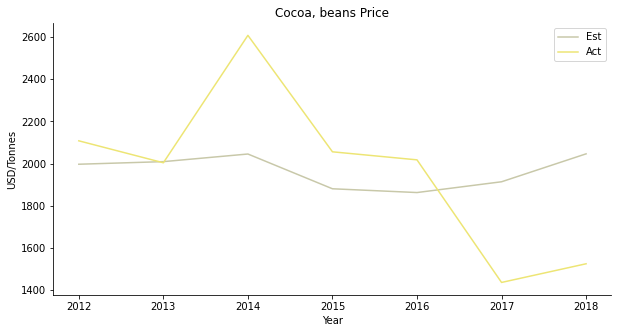

The third one is coconut. Nobody loves coconut rice like Malays. Nothing tastes as delicious as coconut rice with pandan leaves. The estimated coconut price looks the part. The prediction successfully simulates the V-shaped recovery of coconut price.

But the production is severely overestimated. At first, the downhill production of coconut coincides with the collapse of the price. The production hasn’t kept up with the price rebound ever since.

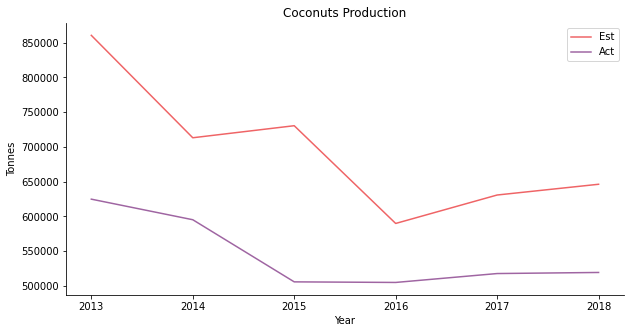

For the regression, supply and demand do not have the explanatory power over the coconut price at the beginning. Gradually, the relationship starts to reveal itself. As Malaysia exports coconut oil for cosmetics products, the domestic demand isn’t sufficient for the model.

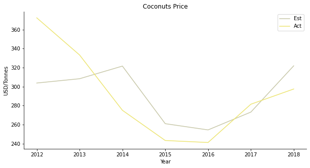

The fourth one is another tropical fruit, mango. You can put it in chicken curry or chendol, either way, so yummy. The price forecast is a disaster. The actual price moves completely opposite to the projection.

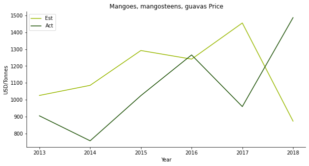

The estimated production follows the trend but with a larger magnitude of fluctuation. Especially in 2015, the model expects a price peak for some unknown reason.

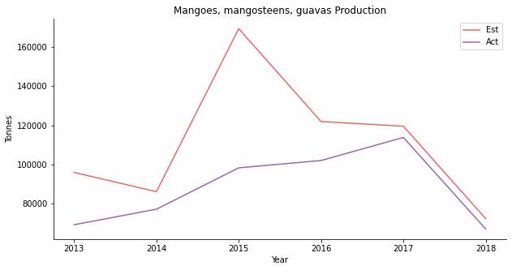

Supply and demand work to certain extent – at least the overall trend is captured. People usually buy imported mango from Thailand. Domestic demand should be able to cover the model. There may be some other hidden factors influence mango demand.

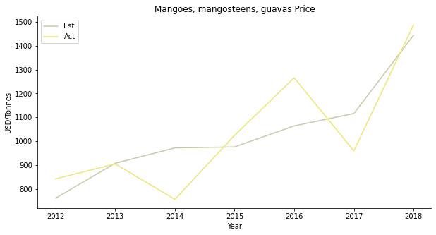

The fifth one is rubber. Rubber is a public traded commodity in SGX with RSS3 and TSR20. It used to play a giant role in Malaysia’s export business before the bonanza of oil palm. Many rubber end products are big industries in Malaysia, such as tyre and condom. The plunge of the rubber price prompts the farmers to switch crops. However, the price prediction works spectacularly well.

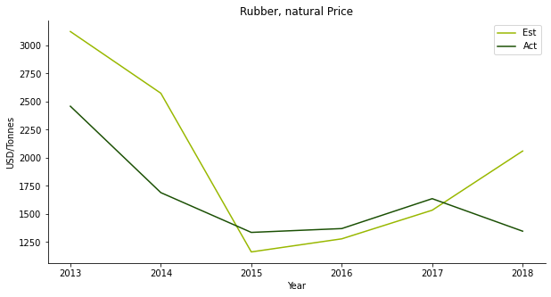

Despite the overestimation of rubber production, the model provides a clear picture of the underlying trend.

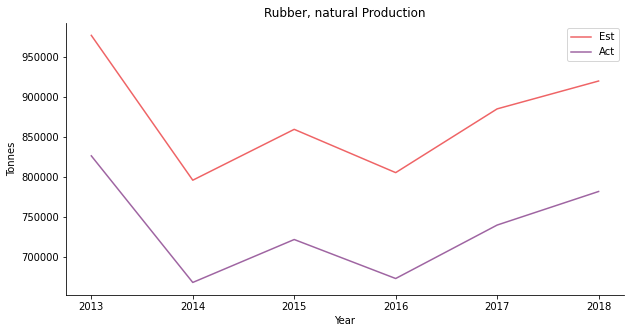
Supply and demand have limited explanatory power on rubber. Since rubber is an export business, the model must take in consideration of international demand.

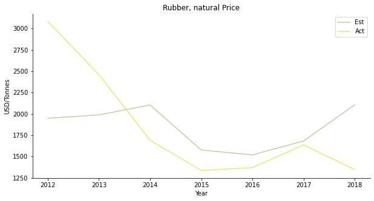

At the first glance, the model works well on the overall production of all 30 crops. If you break down the actual volume of each crop, you will realize oil palm is actually the predominant driver. The total production is merely a reflection of oil palm. Oil palm fruit is the raw material for palm oil. Malaysia is the second largest palm oil producer trailing after Indonesia. The oil palm industry is a pillar of the Malaysian economy.

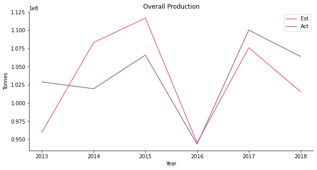

The prediction of oil palm looks a bit weird. In some parts, it shows some features of AR1 model. In other parts, the model appears to be accurate. Oil palm is perhaps the most commercialized commodity among 30 crops in the model. It is rather difficult if not impossible to speculate the price movement of oil palm.

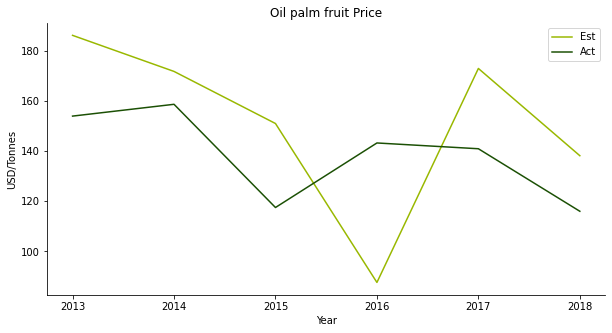

Though the price projection is gibberish, the model yields a convincing outcome on the production. Oil palm possibly has the smallest mean error compared to other crops.

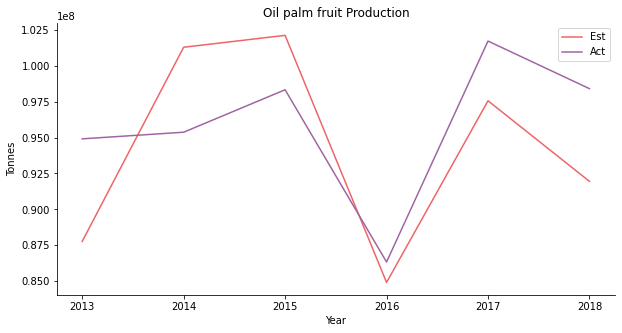

Supply and demand explain the price in the earlier period. Throughout the recent years, the relationship begins to cool down. Palm oil is a lucrative export business in Malaysia. The external business environment should have a bigger influence than local population or GDP per capita.

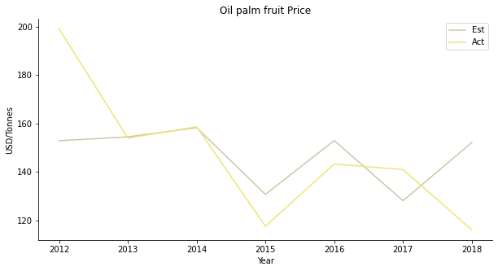

Discussion

To be fair, the excellent result of backtesting occurs because we are using God's eye view. Since we are in 2020, we already know the historical population and GDP per capita of Malaysia. When it comes to trading, the forward-looking capability is what we care the most. To make a price or production forecast, there are many variables to be plugged in. In order to obtain price and production, the framework requires a projection of demand (population and GDP per capita), agricultural land and crop yield. Attributable to the variety of the input, this model is more like a scenario analysis tool. We can adjust each input variable to see how the price and the production of each crop are responding accordingly.

A comparison with futures market is the best way to test the forward-looking accuracy of the model. Bear in mind that not all crops are commoditized in the financial market. Here we select palm oil, for its immense liquidity, to make a forward testing. In Malaysia, there are two types of price associated with palm oil, Fresh Fruit Bunches (FFB) and Crude Palm Oil (CPO). The model per se gives out the raw material price which is oil palm fruit FFB price in US dollar per tonne. The historical benchmark we are using for comparison is Bursa Malaysia Ringgit denominated CPO futures generic first contract. The benchmark requires some computations of annual average and US dollar conversion before plotting. The contract size of the futures is 25 metric tonnes. As a consequence of unit mismatch and other fees involved in the oil extraction, we would visualize both prices in separate axis.

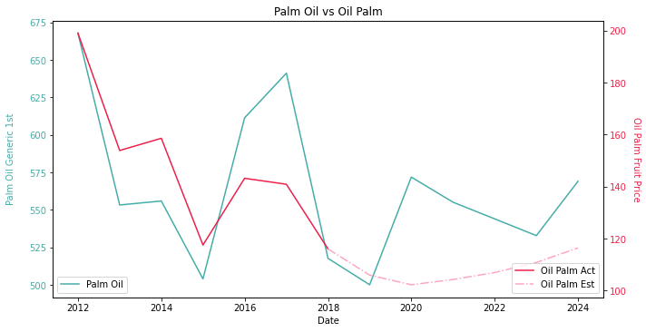

Oil Palm Forecasting and Model Limitations

The forecast for oil palm Fresh Fruit Bunches (FFB) relies on several simplifying assumptions. Demand is estimated using UN population projections and pre-COVID IMF GDP per capita forecasts. We assume a yearly increase of 5% in agricultural land, and use the historical average yield to smooth out any weather-related anomalies. For pricing, we use the CPO futures data from Bloomberg as of July 8. While the backtest performs reasonably well, the forward test results are less convincing. The model predicts backwardation between 2018 and 2020, followed by a contango from 2021 onward. In reality, the price pattern resembled more of a W-shaped recovery, largely due to the global disruption caused by COVID-19. Had we taken a short position in 2018 and continuously rolled over our contracts, it's likely that investor confidence in our strategy would have significantly eroded by 2020.

So, what’s behind this gap in performance? First, the forecasts used were outdated. The pandemic sharply reduced GDP growth and population trends worldwide, affecting demand. Second, agricultural land area is inherently difficult to predict, with high sensitivity to regulation and land-use policy. Lastly, in our model, crop yields remain static, which doesn't reflect reality. A demand surge without a corresponding increase in supply — limited by both land expansion and stagnant yields — inevitably leads to price spikes.

To improve this, we could update population and GDP projections with COVID-adjusted forecasts from economic experts. For yield expectations, insights from agronomists regarding fertilizer trends and climate patterns would be valuable. If no such experts are available, we can instead build scenario-based projections, for example assuming 2% / 5% / 7% annual yield increases.

An additional challenge of forward testing is palm oil’s export-driven nature. While the convex optimization model works reasonably well for domestically consumed crops like peppers or lettuce, it falls short when modeling a globally traded commodity like palm oil. Estimating demand for palm oil may require incorporating major importers such as India, among others. However, the market is highly fragmented—even the top 20 importers together represent less than 75% of total demand (based on Global Trade Atlas data).

To account for this, we propose a generalized Ricardian model. For relatively closed systems like the EU, the original model assuming self-sufficiency is sufficient. But for large agricultural exporters such as the US or Canada, a model based on comparative advantage is more appropriate.

Ricardian Model Adaptation

The Ricardian framework, originally introduced by David Ricardo through the example of wine and cloth trade between England and Portugal, assumes that countries produce goods in proportion to their relative efficiency. Applied here, each country produces each crop based on cost and available land, reflecting its comparative advantage.

To integrate this into our existing structure, we retain most of the naive model’s assumptions but strengthen two of them:

Data Availability Assumption
While FAO offers detailed national price data, the Ricardian version uses a single international price per crop, ideally sourced from CME or ICE futures, regardless of origin. This avoids dealing with complex transportation costs, storage fees, tariffs, and quotas, which are often hidden in policy documents and subject to frequent changes. In doing so, the model assumes no trade barriers, and the market share of each crop is determined solely by cost and plantation size. It also assumes uniform agricultural technology and climate, applying the same yield across all countries.
Homo Economicus Assumption
The naive model assumes farmers act rationally to reach a Pareto-optimal outcome. The generalized version ensures that Pareto optimality is equivalent to Nash equilibrium across countries. This implies no strategic behavior such as collusion or price wars. In reality, international markets are often influenced by these behaviors — think of the oil price war between Russia and Saudi Arabia. Such conflicts may benefit some players, but often shrink the total market value. In contrast, the Ricardian model’s goal is to maximize global profit, even if the gain for each country individually isn’t guaranteed. The idea is to grow the size of the pie, even if not everyone gets a larger slice.

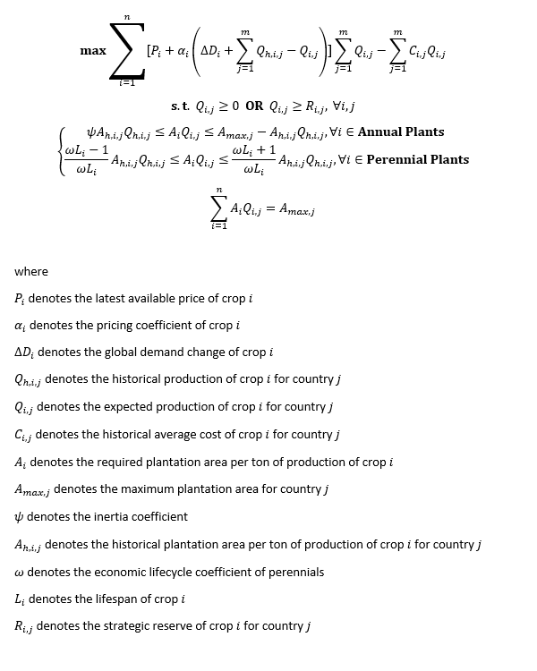

The generalized Ricardian model can be seen as an extension — or a more complex cousin — of the naïve model. Mathematically, the differences are minimal: we simply add another summation operator (Σ) to account for multiple countries, denoted by subscript j. Ideally, the country list should include both importers and exporters for each crop type, capturing at least 90% of global market activity.

However, the real challenge lies in data collection. Given the granularity required by the Ricardian model (prices, yields, costs, land area, technology level, etc. by crop and by country), fully implementing it could take years, if not decades. So, in the spirit of smart farmers, let’s be smart researchers too. If the naïve model performs reasonably well, why fix what isn’t broken?

The key takeaway is: with reliable forecasts of population, GDP per capita, arable land, and crop yield, we can reasonably predict crop production and price one year ahead. This foresight can be used to inform futures trading decisions — such as whether to hold the front-month contract or roll into longer-term maturities.

📚 Further Reading & References
Abadie & Gardeazabal (2003) – The Economic Costs of Conflict: A Case Study of the Basque Country
https://www.aeaweb.org/articles?id=10.1257/000282803321455188
Angrist & Krueger (2001) – Instrumental Variables and the Search for Identification
https://www.aeaweb.org/articles?id=10.1257/jep.15.4.69
Komarek et al. (2017) – Agricultural Household Effects of Fertilizer Price Changes for Smallholder Farmers in Central Malawi
https://doi.org/10.1111/agec.12331
Louhichi et al. (2010) – FSSIM: A Bio-Economic Farm Model for Simulating the Response of EU Farming Systems
https://core.ac.uk/download/pdf/9373170.pdf
Louhichi & Gomez y Paloma (2013) – Modelling Agri-Food Policy Impact at Farm-Household Level in Developing Countries (FSSIM-Dev)
https://publications.jrc.ec.europa.eu/repository/handle/JRC81758
Marshall (1890) – Principles of Economics
https://www.econlib.org/library/Marshall/marP.html
Ricardo (1817) – On the Principles of Political Economy and Taxation
https://www.gutenberg.org/ebooks/33310
